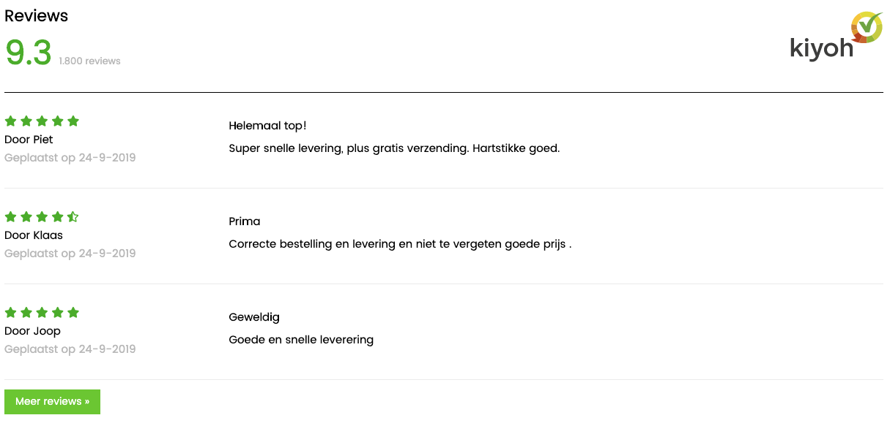
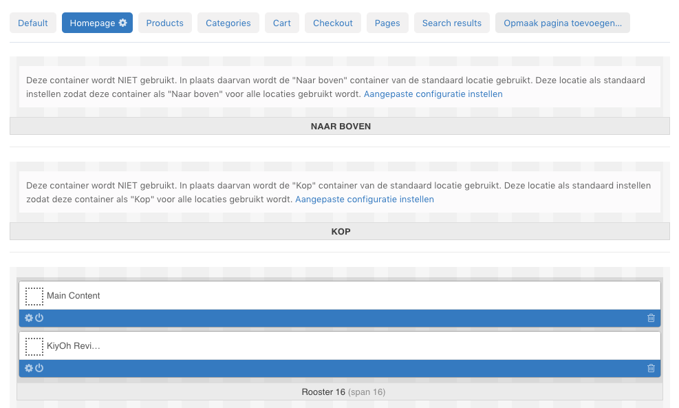
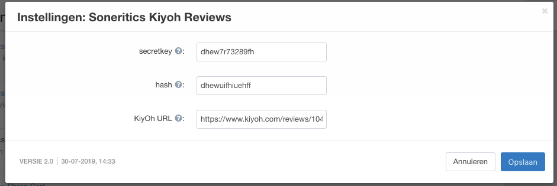

# CsCartKiyoh
[KiyOh](https://kiyoh.nl) reviews for CsCart.

## Remarks
This addon (currently) uses the XML feed API.

To get this plugin working, you should have received the following URL from KiyOh:
* https://www.kiyoh.com/v1/review/feed.xml?hash=...

## Reviews
The plugin will give you a block with the latest reviews:


It will also create pages where all of your reviews are shown, using the same layout as this block.

## Installation
Follow these steps to install and configure the addon:
1) Download the files from this Git repository and upload them to your Cs Cart installation.
  (Only the files in app, design and var are needed.)
    * In the [design/themes] folder, you will find a folder names [YOUR_THEME]. Rename this to your template name. 
2) Next, install the plugin in Cs Cart. (Addons -> Manage -> Browse all Available addons -> Soneritics KiyOh)
3) When the plugin is installed, you can configure it. See the section below for configuration details.
4) You can now add a block with the latest reviews to your site.
   Go to Design -> Layout.
   Usually you want to add a block on your homepage, so open the homepage.
   Next, add the block where you want it to show up. Usually this is somewhere below the main content.
   The block name is *Kiyoh reviews*.
5) Now the block is added, all you need to do is load the reviews into the database.
   In the section 'Refreshing reviews' you can find all the information you need to set this up. 



## Configuring the addon
The configuration of the addon looks like this:


* secretkey
    * This is a key that you will need to update ythe reviews into your own database. You can choose your own key.
       Don't make it too easy, but it doesn't need to be too hard either.
       See the 'Refreshing reviews' for its use.
* hash
    * This is the hash that you received from KiyOh.
* KiyOh URL
    * the URL to your shop on KiyOh. Only used to redirect users to your shop when they click the KiyOh logo.

## Refreshing reviews
Refreshing (or initial loading) of the reviews happens when you open the following URL:
* https://domain/?dispatch=soneritics_kiyoh_refresh.action&secret={secretkey}

{secretkey} should be replaced with the configured value, as described in 'Configuring the addon'.

Now, you can simply open this in your browser, but it's better to automate this.

For example, you can create the following cronjob to automatically update your feed every day at 3:00 AM.
```
0 3 * * * /usr/bin/wget -O /dev/null https://domain/?dispatch=soneritics_kiyoh_refresh.action&secret={secretkey} >/dev/null 2>&1
```
